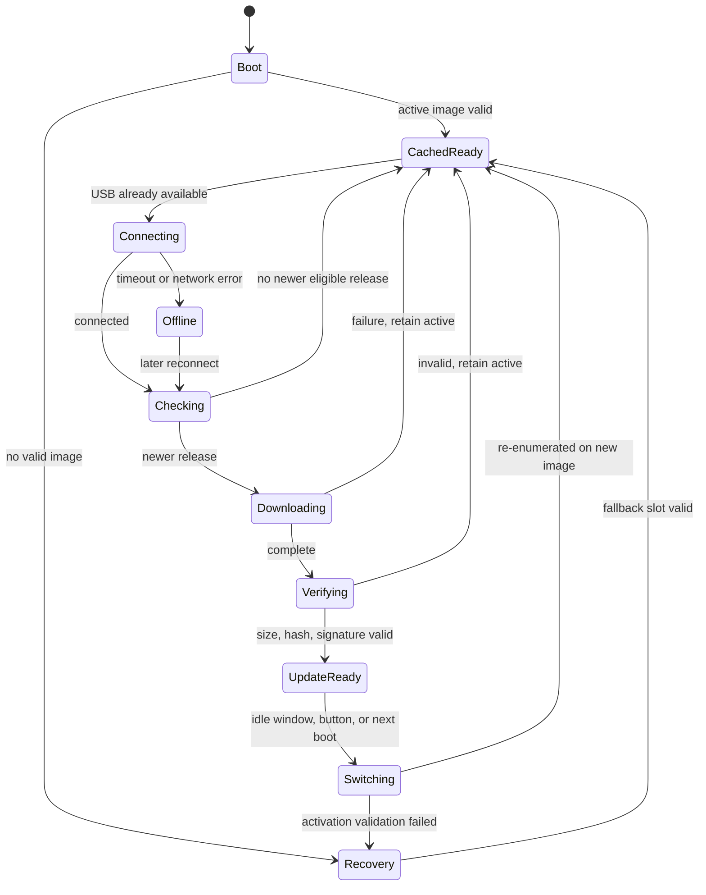

# Runtime state machine

Every SCSI read is counted while in progress. Button activation first disconnects the USB medium and waits for the active-read count to reach zero before changing the file handle. No automatic activation occurs. On every power cycle, firmware evaluates both committed metadata records and selects the newest record whose complete image passes size and SHA-256 verification.
